# Online Learning for ReID

## 2019.2.22
> 1.完成第一个版本的训练   
> 2.完成结果分析

### training loss

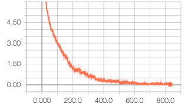

### 分布变化情况

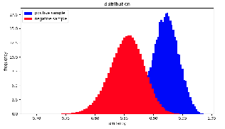
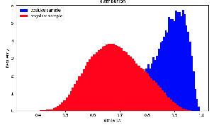

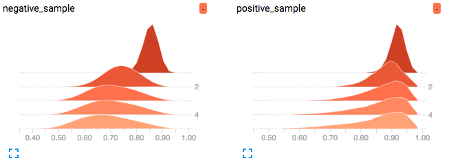

### 测试结果
在 5 个 epoch 的时候进行测试，R1(42.8 -> 24), mAP(22.1 -> 9.7)

### 问题分析
1. 每次 sample 出来进行训练的样本全是负样本，基本无法 sample 到正样本
2. 虽然 loss 在降低，由于没有正样本，所以类内之间没有约束，只有类间的约束，虽然分布被推开了，但是分布的方差变大了，相当于类内之间的效果变差了
3. 由于类内之间差距也在变大，导致 sample 数据的阈值也在朝着不好的方向发展，加剧了 sample 正负样本的难度

### 下一步的改进
1. 加入有 label 的 trainset，保证正负样本的比例
2. 如何对 unlabel 的数据进行更有效地 sample？
3. 阈值的选择是不是要取分布的最边缘？
4. 如何做聚类？
5. meta learning 的 setting

## 2019.1.15
### 数据集统计
1. `train.txt` -> train set, 100 个 id，每个 id 5 张图，一共 500 张图
2. `validation.txt` -> validation set, 100 个 id，一共 1814 张图
3. `online.txt` -> online train set, 651 个 id，一共 10622 张图

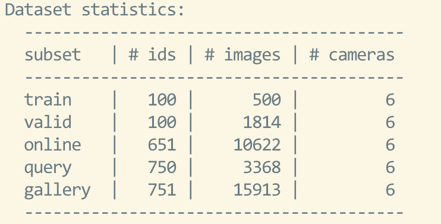

### 训练流程
1. 在 `train.txt` 上训练 basemodel  
2. 在 `validation.txt` 上画出分布曲线，并确定阈值  
3. 对 `online.txt` 进行sample，根据如下规则进行训练  
    

    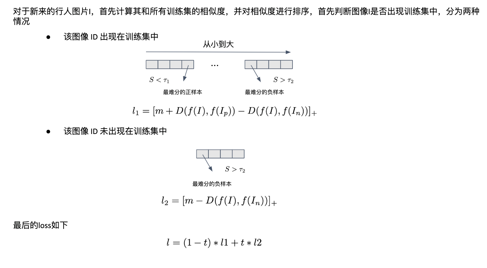
    

4. 不断重复 2 - 3，同时 check online 生成的 label 是否正常

### 结果
在 100 个 ID 上面 train 的 basemodel 结果如下

| datasets| rank1| mAP |
| ---| ---| --- |
| market1501| 42.8| 22.1 |

在 100 个 ID 的 validation set 上的分布如下

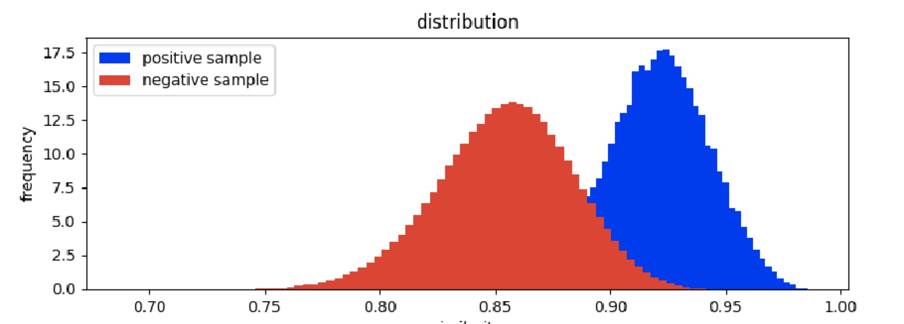

因为训练集较小，所以正负样本重叠的区域比较多，按照我们的思路，可以用 online learning 进行优化

------

## 2019.1.14
### Hypothesis
我们假定 ReID 数据集在 testset 下应该有如下的分布

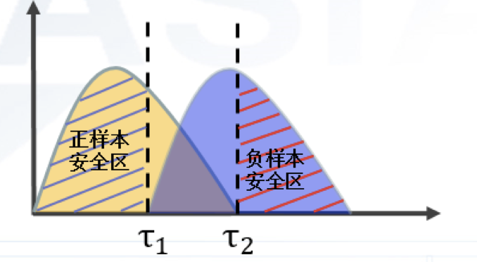

三个数据集(market1501, cuhk03 和 dukemtmc) testset 上面的分布图如下

#### Euclidean Distance

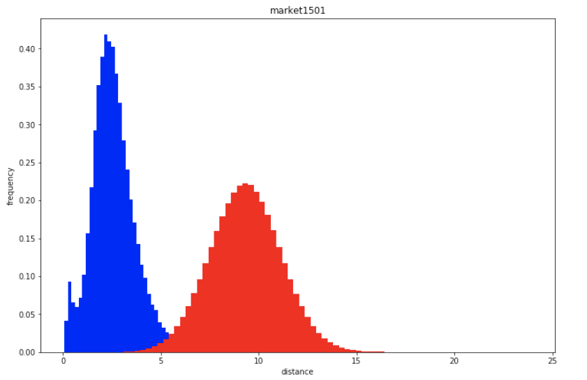

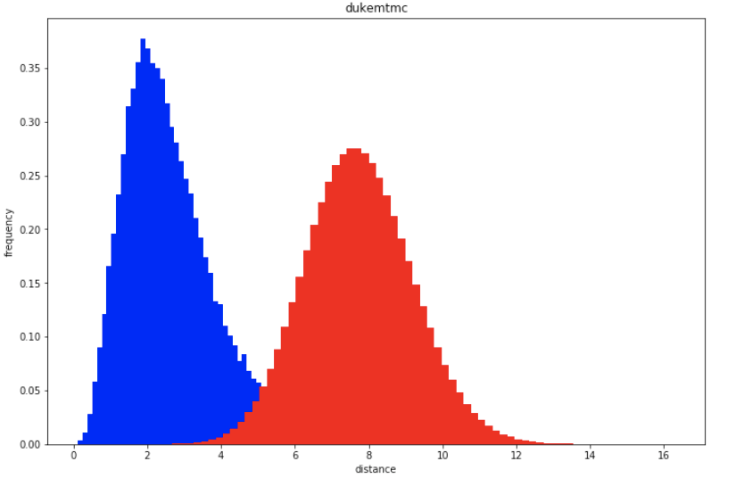

不同 domain 下 euclidean distance 的 scale 不统一

#### Cosine Similarity

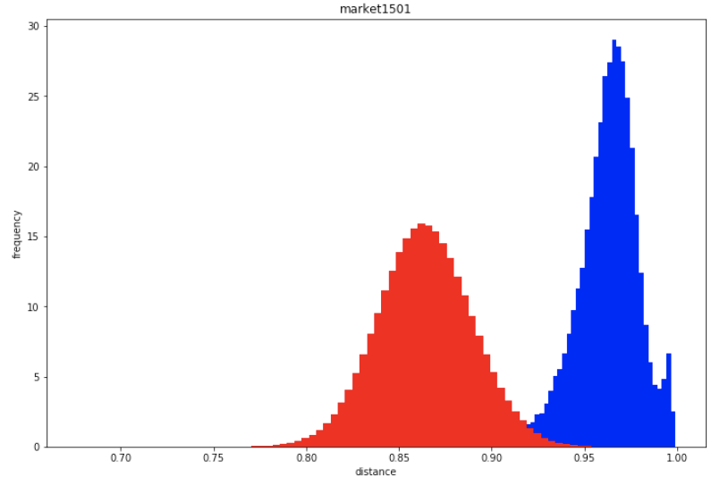
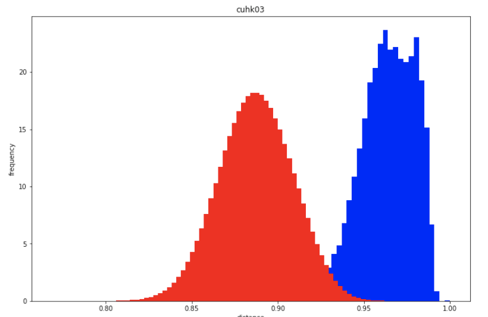
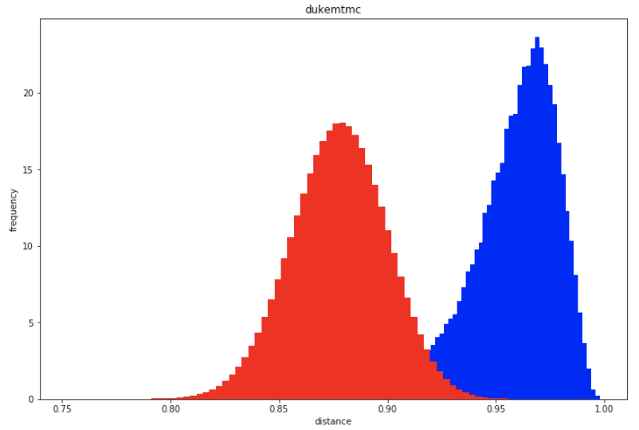

所有的 domain 下面 cosine similarity 的 scale 基本一致，我们的 hypothesis 基本成立

### 划分数据集
1. train set，从整个 training
set 选择 100 个人，尽量选择图片数目大于 5 的人，然后每个人 5 张图片，一共 500 张图片构成 train set 来训练 basemodel
2. validation set，选择 100 个人用来 determine 阈值
3. online train set，整个 training set 剩下的数据作为 online train set，没有 label，每次过来一部分数据集
4. test set，原始的 query/gallery set 对 model 的performance 进行测试
